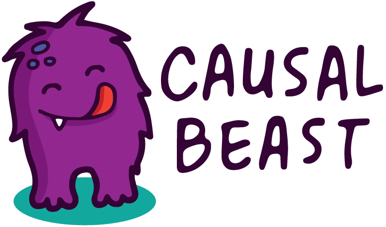
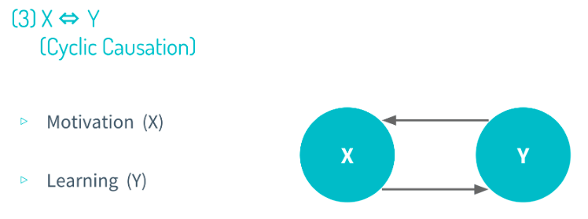

# Causal Beast



Causal Beast is easily the most comprehensible primer on causal inference. I designed this curriculum with the assumption that people could learn causal inference with no explicit STEM prerequisites.

## Scope

A technical treatment of causal inference is not what this course is about, and the reason for this is simple. If you are attending university and studying any one of the social sciences, you will probably be exposed to a technical treatment of the topic. And since I believe those university courses to be doing a good job, I do not want to this course to be a lesser substitute.

I just had one goal in mind when designing Causal Beast. Chiefly upheld above all of its ambitions is to be as accessible as possible. That means tons of graphs - graphs which are so easy an 8th grader can even discern what's going on.

From Lesson 2:



## Format

The format of Causal Beast is that of a MOOC. There are video lectures with accompanying notes. The app which hosts the MOOC content was built using Jekyll, a static site generator written in Ruby.

## Locally Hosting

Install Jekyll and bundler gems:

```
bundle install
```

Serve the app locally:

```
bundle exec jekyll server
```

Start the app:

```
npm start
```

## Public URL

The project is also deployed on Netlify. Check out this [link](https://causal-beast.netlify.app/about/). 

## Contributing

I know this is not perfect. It could definitely use more pair of eyes. If you're interested in contributing, please let me know! I'd be glad to get in touch with you. 

## Credits

Many thanks to all the people who made creating this course an enjoyable process. Well job done! 👏👏

- Grace McCormack (advisor)
- Matthew Polly (text-to-speech)
- Antonela Carpena (illustrator)
- David Robinson (inspiration)
- Matthew Masten (inspiration)